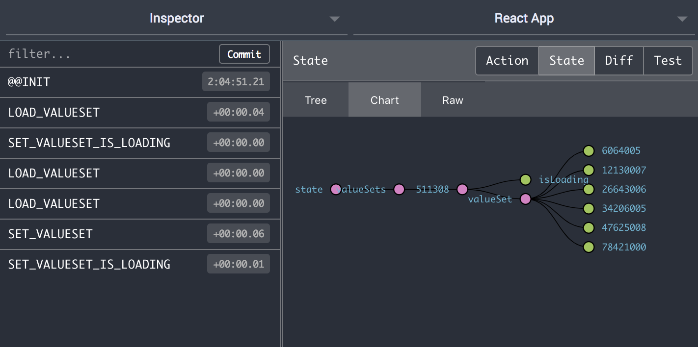

# Redux and Mobx showdown

I've been using Redux for a project, and honestly, **I don't like it**. I decided to write a simple app in Redux and then write it again in MobX to compare the two approaches to state management.

The app loads a network resource, and displays it. Pretty simple stuff. To make this a bit more realistic, I also wanted to handle:

- loading states
- errors
- duplicate network requests (only one request should happen)

## Update

2020-01-31: It's not React, but I added a <a href="https://svelte.dev">Svelte</a> example since it sensibly includes it's own store.
I'm not going to mix Svelte into all the commentary below, so have a look for yourselves. (It's pretty sweet!)

- <a href="https://github.com/xinsight/mobx-redux-showdown/tree/master/svelte-app">svelte-app</a>: Svelte

2018-11-26: I received a total rewrite of the redux app by <a href="https://github.com/markerikson">markerikson</a> using `redux-starter-kit`, and I've added it to the shootout. I'll need to update my comments below since it addresses *many* of the pain points with Redux.

There are now three React apps in the repo:

- <a href="https://github.com/xinsight/mobx-redux-showdown/tree/master/mobx-app">mobx-app</a>: MobX
- <a href="https://github.com/xinsight/mobx-redux-showdown/tree/master/redux-app">redux-app</a>: Immutable.js, sagas, hand-written action creators
- <a href="https://github.com/xinsight/mobx-redux-showdown/tree/master/redux-starter-kit-app">redux-starter-kit-app</a>: thunks, automatic action creators, simplified createStore, redux logic is in a single file, and more

tldr; There are many ways to use Redux - choose wisely!


## Number of files

Let's start with something simple and concrete. The number of files:

*Redux*
9

*Redux Starter Kit*
7

*MobX*
6

Why does Redux have more files than MobX? That's because of the Redux way of looking at the world and splitting things into actions, reducers, selectors, and sagas (for handling the network request).

*Redux*
```
redux-app/src/redux/features/valueSets.js
redux-app/src/redux/reducers.js
redux-app/src/redux/sagas/sagas.js
redux-app/src/redux/selectors/valueSetSelectors.js
```

*Redux Starter Kit*
```
redux-starter-kit-app/src/features/valueSets.js
redux-starter-kit-app/src/store.js
```

*MobX*
```
mobx-app/src/ValueSetStore.js
```

With Redux, I initially had actions in a separate file, but that was a terrible idea in practice as it was just a lot of monkey-work to deal with imports. Following the [ducks](https://github.com/erikras/ducks-modular-redux) setup, I refactored so that actions, reducer, action creators and sagas are in one file. A definite improvement, but still, the selectors are in a separate file and things are a bit more spread out compared to MobX's single class.

`redux-starter-kit-app` uses some helpers to also reduce the valueSet store down to a single file. (I haven't fully digested the magic.) The additional file is just a global store that pulls in all the feature stores.

## Verbosity

Ok, so Redux means you're managing more files, but what about the code in those files?

Let's compare how you would add a bit of data you add to your app:

*Redux*
- a way to set the data (reducer)
- a way to get the data (selector)
- actions for getting and setting the data

*MobX*
- add a variable to a store
- make it observable

With Mobx and decorators, this can be done with one line. With Redux, the selectors and reducers are added in 2 different files (which we've covered) but there is also the additional idea of an "action". What's up with actions?

Since the parts of Redux are so loosely coupled, you cannot call functions or properties directly, but need to write actions. And then you have to write both sides of the action: the sender which dispatches the action, and a receiver to observe and handle the action.

Actions involve some brain-dead boilerplate like `const FETCH_VALUESET = 'FETCH_VALUESET'` which isn't hard, but is annoying. (And with copy/pasting it's easy to accidentally duplicate the string for two vars which will lead to some head scratching.)

## Components

So you have a store, and now you want to access the data from a component:

*Redux*
- connect your component
- add/edit mapStateToProps to get (select) data
- add/edit mapDispatchToProps to set (write) data

*MobX*
- inject your store
- call functions to get, set, etc.

With MobX, once you inject your store, you have access to every function and property of the store. You can call functions directly, and don't need to dispatch an action to trigger a network request, or call selectors to get the eventual result of the network request. And you don't need to create the `mapStateToProps` and `mapDispatchToProps` objects.

## Creating a store

Let's take a step back and look at how you setup a store. This is something you don't have to do that often, but it's still critical.

*Redux*
```
import createSagaMiddleware from 'redux-saga'
import { composeWithDevTools } from 'redux-devtools-extension'
import rootReducer from './redux/reducers/reducers'
import rootSaga from './redux/sagas/sagas'

const sagaMiddleware = createSagaMiddleware()

const store = createStore(
  rootReducer, // 0: reducer
  composeWithDevTools(
    applyMiddleware(sagaMiddleware), // 1: middleware
  )
)

sagaMiddleware.run(rootSaga)

class App extends Component {
  render() {
    return (
      <Provider store={store}>
        ...
      </Provider>
    )
  }
}
```

*MobX*
```
import { Provider } from 'mobx-react'
import ValueSetStore from './ValueSetStore'

const valueSetStore = new ValueSetStore()

class App extends Component {
  render() {
    return (
      <Provider ValueSetStore={valueSetStore}>
        ...
      </Provider>
    )
  }
}
```

Redux clearly requires much more hand-holding - mainly because it doesn't handle asynchronous actions out-of-the-box, you so need to configure it to use a separate library (redux-thunk or redux-saga). MobX is simple enough to be done from memory.

`redux-starter-kit-app` can create a store with redux-thunk middleware in one-line.

## Debugging



In the Redux setup I added the Redux dev tools, because that seems to be a popular tool for visualizing how react works. It's pretty and makes a good first impression, but I prefer the raw JSON to the tree visual. And in practice, I found the devtools to be useful for solving easy problems (a missing property of an action), but unhelpful for solving trickier issues (actions being called unexpectedly or an action not being called at all). I find that adding a breakpoint and typing `JSON.stringify(store)` is often just as useful. It's also a bummer that breakpoints cannot be used with devtools, since once you pause on a breakpoint, the redux devtools are paused as well.

MobX has some in-browser debugging tools, but I've never found the need. You can just drop a breakpoint in your store, and then inspect or step through the code as you normally would.

## Other Libraries

What about helpers and other libraries?

*Redux*
- immutable
- redux-saga

*Redux Starter Kit*
- react-thunk

*MobX*
- [none]

Immutable is not strictly needed, but was recommended for when your global store starts to get complicated. And in this example, just using `getIn` and `setIn` was simpler than having to dealing with plain javascript objects and the spread syntax.

As mentioned, Redux doesn't handle asynchronous operations out of the box, so you need to add some middleware. I looked at a bunch of different libraries, but the general consensus seemed to be that sagas were the new hotness and good for complex logic. They use generator functions and definitely have a learning curve.

## Conclusion

Don't make a decision based on github stars alone.

**Redux**
52k

**Svelte**
29k

**MobX**
21k

Browse the code for the 
[Svelte](https://github.com/xinsight/mobx-redux-showdown/tree/master/svelte-app/src),
[Redux](https://github.com/xinsight/mobx-redux-showdown/tree/master/redux-app/src),
[Redux Starter Kit](https://github.com/xinsight/mobx-redux-showdown/tree/master/redux-starter-kit-app/src) 
and [MobX](https://github.com/xinsight/mobx-redux-showdown/tree/master/mobx-app/src) apps. Let me know if you have any issues or suggestions for improvement.

